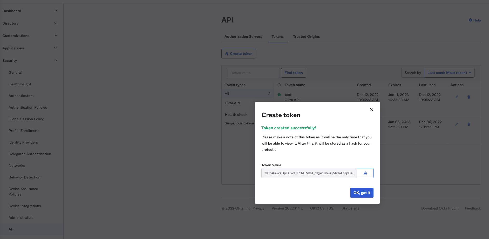
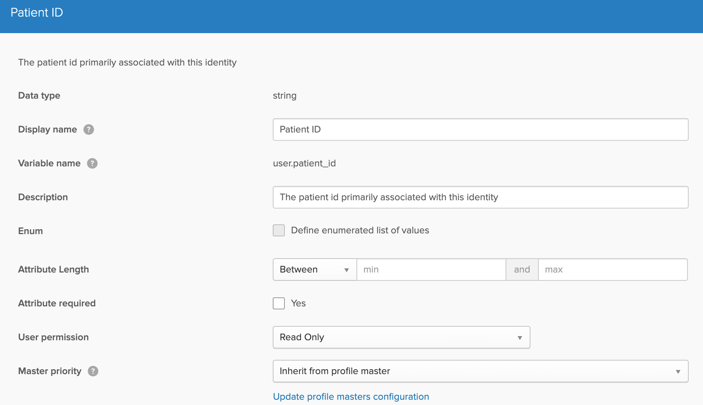
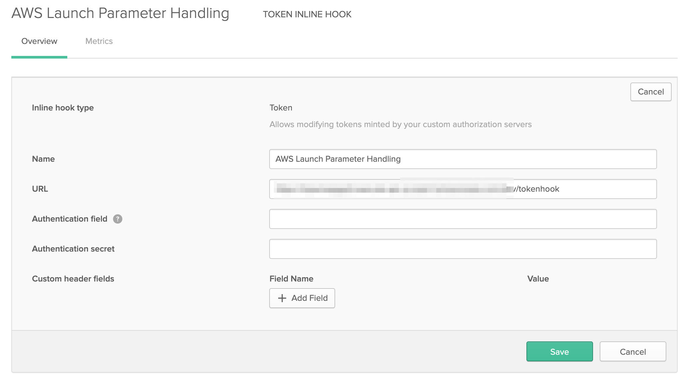
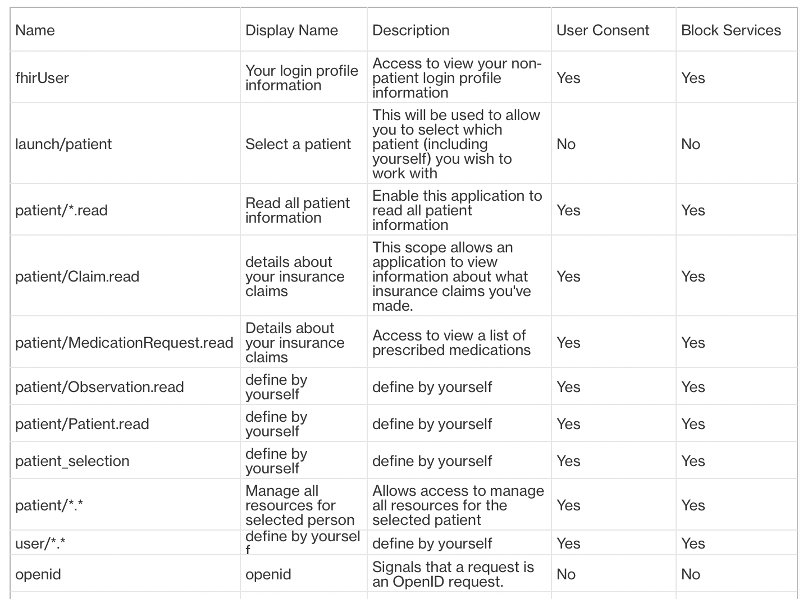
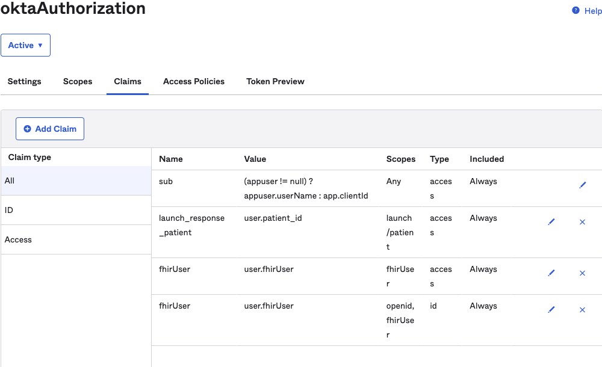
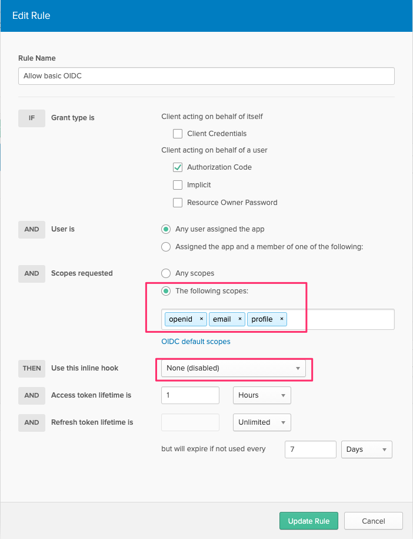
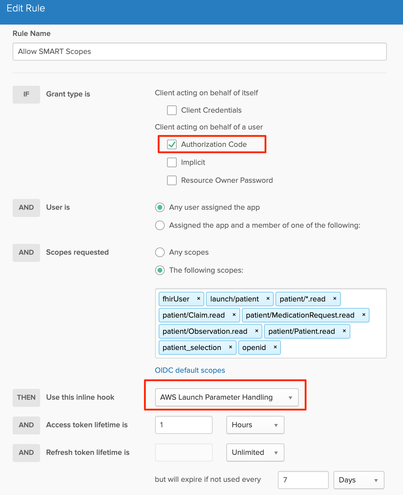
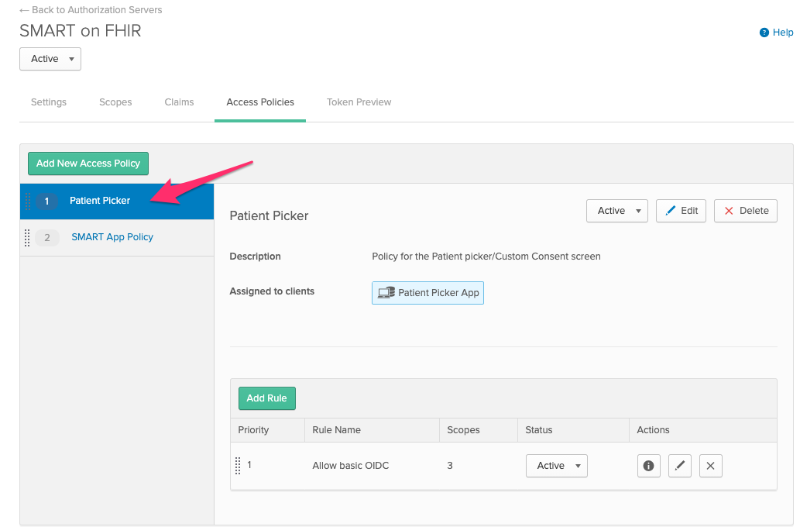

# Okta SMART on FHIR Setup Guide
## Introduction
This guide is intended to walk you through how to setup your very own reference SMART on FHIR implementation using Okta as the identity platform.
For an overview of this project and all of the components, please see here: [Project Introduction](./README.md)

## Guide Index
* [Prerequisites](#prerequisites)
* [Solution Deployment and Initial Okta Setup](#solution-deployment-and-initial-okta-setup)
* [Okta Profile Setup](#okta-profile-attribute)
* [Okta Token Hook Configuration](#okta-token-hook-configuration)
* [Okta Authorization Server Configuration](#okta-authorization-server-configuration)
* [SMART Client Registration - Confidential](#smart-client-registration---confidential)
* [SMART Client Registration - Public](#smart-client-registration---public)

## Prerequisites
* An Okta tenant ([Get one here free](https://developer.okta.com/signup))
* Node.js 12+
* Serverless framework ([Get started here](https://www.serverless.com/framework/docs/getting-started/#via-npm))
* OpenSSL libraries (included on any *nix distribution)
* Postman, or other API invocation tool (not strictly required- but will make configuration easier)

## Solution Deployment and Initial Okta setup
In this section, we'll do some initial Okta setup, as well as deploy all of the requisite endpoints to our chosen cloud serverless platform.

### Step 1- Install and configure the serverless framework
* [Get started here](https://www.serverless.com/framework/docs/getting-started/#via-npm) (Install serverless)
* [Provide the platform with AWS credentials](https://www.serverless.com/framework/docs/providers/aws/guide/credentials/)

### Step 2- Clone the reference implementation repository into your development machine filesystem.
```bash
git clone https://github.com/dancinnamon-okta/okta-smartfhir-demo.git
cd okta-smartfhir-demo
```

### Step 3- Generate an SSL public/private key that will be used by the token endpoint to authenticate with Okta.
```bash
openssl genrsa -out private_key.pem 2048
openssl rsa -in private_key.pem -out public_key.pem -pubout -outform PEM
```
***Note - at this time the file names are hard-coded, so please name them exactly as-is (or submit a PR to make this configurable)***

### Step 4- Install global dependencies (same for all cloud platforms)
```bash
mv serverless.aws.example.yml serverless.yml (or platform of choice)
npm install
```

### Step 5- Install cloud platform specific dependencies, and prepare for configuration
```bash
cd aws (or platform of choice)
npm install
```

### Step 6- Create the authorization server in Okta
In Okta, create a custom authorization server (in the Security->API menu) that you'll be using to authorize users in the demo.
Give the server whatever name you'd like.  Put in a placeholder value in the "audience" field for now- we'll update it later.
Don't worry about any other authorization server configurations- it'll be fully configured later in this guide.

Update the serverless.yml with the proper details:
```yaml
#Get AUTHZ_ISSUER from Security→ API → Click the Authorization server you created and →setting → Metadata URL: the first key “issuer“ includes AUTHZ_ISSUER
AUTHZ_ISSUER: https://_YOUR_ORG_.okta.com/oauth2/_YOUR_AUTHZ_SERVER_
AUTHZ_SERVER: _YOUR_AUTHZ_SERVER_
OKTA_ORG: _YOUR_ORG_.okta.com
```

### Step 7- Create the Patient Picker application in Okta
In Okta, create a new OIDC web application (in the applications menu), using the authorization code flow only.  Remember to assign your users to this app.
Update the serverless.yml file with the proper details:
```yaml
#Go to Okta→application→ Patient Picker application → General:
#Client Credentials → Client ID for PICKER_CLIENT_ID 
#Client Secrets → Secret for PICKER_CLIENT_SECRET
PICKER_DISPLAY_NAME: Patient Picker
PICKER_CLIENT_ID: _CLIENT_ID_FOR_PATIENT_PICKER_
PICKER_CLIENT_SECRET: _CLIENT_SECRET_FOR_PATIENT_PICKER_
```

### Step 8- Create an API key for the Patient Picker
At this time, the Patient Picker application uses an API key to read authorization server details, so we need an API key minted. PR's are welcome to update to use OAuth2 instead of an API key. Use the Security->API->Tokens menu to create this token.

Update the serverless.yml file with the proper details:
```yaml
API_KEY: _AN_API_KEY_
```
_AN_API_KEY_ is the token value in the screenshot.


### Step 9- Deploy!
To deploy this example, run the following command:
```bash
serverless deploy 
```

At this point you should have a number of serverless functions in AWS (until other clouds are supported).  Continue on to setup the rest of the assets in Okta to support this reference implementation.

## Okta Profile Attribute

Now we need to add SMART specific Okta profile attributes. Start by navigating to the Directory -> Profile Editor -> 🖊️ Profile

### patient_id

A key requirement of a SMART/FHIR deployment is the ability to associate a patient id with a user record.  To satisfy this requirement, we need an Okta profile attribute that will hold a patient id for each patient user within the system.
In the Okta profile editor, create a string attribute called "patient_id" as shown:


### fhirUser

Another aspect you may need to support is identifying non-patients, like [Practitioners](https://www.hl7.org/fhir/practitioner.html) or [Persons](https://www.hl7.org/fhir/person.html). To satisfy this requirement, we need an Okta profile attribute that will hold the fhirUser.
In the Okta profile editor, create a string attribute called "fhirUser"

## Okta Token Hook Configuration
The token hook is executed at runtime by Okta, and is responsible for ensuring that the custom consent process was properly followed, and in addition it ensures that the consent selections made by the user "which patient, which scopes" are honored.

If an attacker (or curious user) attempts to alter the authorization request data, or bypass the custom consent screen altogether- the token hook will fail validation, and then entire authorization request will fail.

To configure the token hook, use the Workflows->Inline Hooks menu to create a "Token Inline Hook" as shown:
Note: the value you'll use is the URL for your API Gateway URL + tokenhook. Example (found in outputs of serverless deploy): `https://{uid}.execute-api.{region}.amazonaws.com/{stage}/tokenhook`


## Okta Authorization Server Configuration
A key element in this reference SMART/FHIR implementation is a properly configured OAuth2 authorization server supplied by Okta. This authorization server was created earlier in the setup process when the Okta-SMART endpoints were deployed.  In this section we'll edit that same authorization server to finish it's configuration.

Update the "audience" of the authorization server to match the url of your FHIR Resource Server. See [2.5.1](https://docs.smarthealthit.org/authorization/best-practices/).
The reference implementation comes with example resource server endpoints- so if you're using this implementation for example/reference purposes, this value will take the form: https://xxxyyy.execute-api.us-east-1.amazonaws.com/dev

(After completing the deployment of FHIR Works SMART, run the following part to update the audience)
* Find https://xxxyyy.execute-api.us-east-1.amazonaws.com/dev in the apiGatewayRestApiEndpoint key( shows in the outputs of deployment of Smart FHIR or Info_Output.log in Smart FHIR) to update the audience part for the autorization server of Okata:  (Okta→Security→API→Authorization Server you created -> Settings -> Audience)  
* Update EXPECTED_AUD_VALUE using the same apiGatewayRestApiEndpoint in serverless.yml for the "audience"
* Redeploy the Okta stack
```yaml
serverless deploy
```
### Scopes
The first piece of configuration required is to setup the valid SMART authorization scopes in Okta as valid scopes (in the Security->API->Authorization Servers menu).

The following document contains a sample API call that can be used to create all of the claims/scopes necessary.<<TODO: Generate this script>>

Below are a few example scopes that can be configured manually. All scopes shows in the following table
(Display Name,Description are the contents you can define by yourself since they will not affect the setup)


### Claims
Given that the bulk of the SMART specification relies on OAuth2 (and supports opaque tokens), there are minimal requirements for setting up claims in Okta.

Only two claims are required for this reference implementation:

#### Patient Launch Response

* Claim Name: launch_response_patient
* Claim Value: user.patient_id
* Include with Scope: launch/patient
* Include in: Access Token

**Launch Parameter Response Claims**
The SMART launch specification requires any session-level information (such as patient id) to be returned in the /token response alongside the access token.  Okta does not support this out of the box, so the reference implementation includes a /token proxy that will satisfy this requirement.

The token proxy will take any claim in the access token that begins with **_launch_response__** and it will include that claim alongside the access token in the /token response.
For example, a claim in Okta called "launch_response_patient" will cause the token proxy to include a parameter called "patient" in its response alongside the access token.  This works with ANY claim- not only the patient parameter.

#### FHIR User

* Claim Name: fhirUser
* Claim Value: `user.fhirUser`
* Include with Scope: fhirUser
* Include in: Access Token
* **Note:** Adding this claim to the `access_token` is not strictly required by the SMART specification but when interacting with your FHIR Server this is a secure method to authenticate who the requestor is.

#### FHIR User (OpenID Connect Claim)

* Claim Name: fhirUser
* Claim Value: `user.fhirUser`
* Include with Scope: openid,fhirUser
* Include in: ID Token

An example screenshot is shown below:



### Access Policies
Access Policies in Okta determine security controls for applications and users as they authorize via OIDC/OAuth2.  They detrermine which scopes an application may request, which ones may obtain a refresh token, token lifetimes, as well as other parameters.

For this reference implementation we require 2 Access Policies:
* One policy that will apply to only the patient picker application.
* One (seperate) policy that will apply to all SMART-enabled applications.

**Patient Picker Access Policy**
Configure the policy/rule as follows and shown:
Applied to Clients: Patient Picker
Allowed Grants: Only Authorization Code
Scopes: openid, email, proflie
Inline Hook: NONE


**SMART Application Access Policy**
Configure the policy/rule as follows and shown:
Applied to Clients: All (for demo purposes)
Allowed Grants: Only Authorization Code
Scopes: All scopes (for demo purposes- more granular control may be applied for production purposes)
Inline Hook: Select the token hook you created earlier


Note: Okta's Access Policies execute in a prioritized "first match" manner.  This means that the "Patient Picker" policy MUST be priority number 1 in order to take effect!



